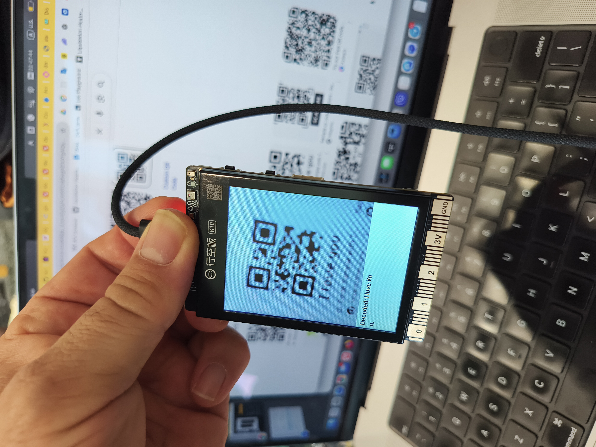

# QR Code Reader for ESP32 / UNIHIKER K10

This is a simple PlatformIO project for the UNIHIKER K10. It reads QR codes from the built-in camera and displays the decoded text on the screen.

I vibe coded this in 5 minutes.

